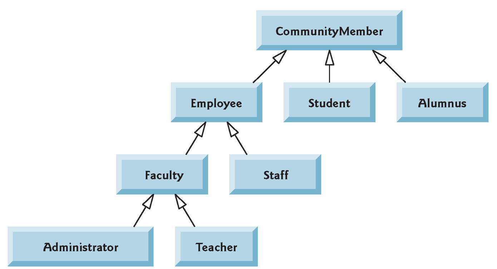

# Inheritance
## sub & super classes


---
## Today
1. Inheritance.
  + subclasses and superclasses.
1. Overriding methods.
1. The `super` keyword.
1. `Object` as the superclass of all Java classes.


---
## Resources
+ Chapter 9 of the Deitel.
+ [Inheritance](https://docs.oracle.com/javase/tutorial/java/IandI/subclasses.html)


---


A UML diagram demonstrating inheritance.


---
### Subclasses
+ We can extend an existing class by defining a subclass.
  + also called a *derived* class.
+ It inherits all of the code and variables of the original class.
+ Can add more.
+ Can also **override** methods.
+ the original class is called the **superclass** of the new class.


---
@code[java code-max code-noblend](src/Bicycle.java)
A simple class.

---
@code[java code-max code-noblend](src/MountainBike.java)
We can think of `MountainBike` as having all the code of `Bicycle` for free.


---
### UML diagram
@img[span-75](resources/bikes.png)


---
@code[java code-max code-noblend](src/MainForMountainBike.java)
It works!

But why does `MountainBike` use `getSpeed()` and not directly use `speed`?


---
@box[rounded](private members of the superclass are **hidden** in the subclass.)

Recall the access rules for class members,
+ `public`:  from anywhere.
+ `private`: only from within the class.
+ default (package-private): from anywhere within the same package.
+ `protected`: like default, and from subclasses of other packages as well.


---
A simple `Employee` class. 
@code[java code-max code-noblend](src/Employee.java)
@[1-12](Notice that `monthlySalary` is protected.)
@[14-18]

---
### `CommissionEmployee`
+ Gets a monthly salary (like `Employee`),
+ and a **commission** on his sales.
  + If he sold for *x* dollars, and his commission is *p*, then 
    he gets an extra *xp* dollars.

We can write a new class, but this will duplicate a lot of code.


---
@code[java code-max code-noblend](src/CommissionEmployee.java)
@[1-13](Use `super` to call a constructor of the superclass.) 
@[15-19](Overriding a method.)


---
@img[span-75](resources/employees.png)

Note how we denote `private`, `public` and `protected` members.


---
What will this print?
```java code-noblend
CommissionEmployee e = 
	new CommissionEmployee("Greg", 100, 0.1);
e.setSales(1000);
System.out.println(e);
```
Remember that `toString` is from `Employee`, and was not overridden. So does it call the new or old `earnsInYear()`?

@css[fragment]("Greg earns 1300", correctly!)


---
The superclass's  `toString()` calls the new `earnsInYear()`.

@box[rounded](Think of the subclass as taking all the **code** of the superclass and rewriting some of the methods)

@css[fragment](*Except private members are hidden from the new code...*)


---
### Overriding Methods
The way to change the behavior inherited from the superclass.

+ The `@Override` annotation is optional,
  + If the **signature** of the method does not match any method from 
    the superclass it gives a warning.
  + So use it!


---
### `super`
To access the overridden method (the original one), use the `super` keyword.
For example: 
```java code-noblend
@Override 
public double earnsInYear() {
	return commission * sales + super.earnsInYear();
}
```
There is no direct way to access the ''grandmother'' methods, `super.super` does not work.


---
### Constructors
+ Constructors of the superclass are not constructors of the subclass.
  + `super(...)` calls a constructor of the superclass.
  + Must appear as the **first line** in the constructor!
+ For now, always put a `super` call as the first line of a constructor.


---
### A Complex Example

Let's start with a simple class, that is initialized with an array, 
and has a method to sort it. 

Later, we will want to subclass it, and encounter some problems...

Let's first see how we use it:

---
@code[java code-max code-noblend](src/MainForSortedArray1.java)


We will use **insertion sort**, which is considered the
fastest sorting algorithm for small arrays. It is used as the base case
for many recursive sorting algorithms.


---


---
@code[java code-max code-noblend](src/SortedArray1.java)
@[1-10](Constructor just copies the array.)
@[12-19](Insertion sort.)
@[21-24](recall the static method `toString` of class `Arrays`.)


---
### Next

+ We would like to associate with each number in the array a name. 
For that we will define `NamedSortedArray`, which is a subclass of `SortedArray`.

@css[fragment](*For example:*)


---
@code[java code-max code-noblend](src/MainForNamedSortedArray.java)

Sorting is done according to the numbers, and the strings follow the same new ordering.


---
### The problem
+ Let's make a subclass `NamedSortedArray` of `SortedArray`.
+ Constructor takes the int array and names array.
+ Overriding `sort` forces us to write the whole algorithm again.
  + Imagine this is a very complex sorting algorithm...

*How can we solve this?*


---
@img[span-75](resources/arrays.png)

Change `SortedArray` by **extracting** from `sort` the method `swap`,
and then we only need to override `swap`!


---
@code[java code-max code-noblend](src/SortedArray.java)
@[12-22](Note that `swap` is `protected`. We don't really want it to be `public`, yet we need to override it.)


---
@code[java code-max code-noblend](src/NamedSortedArray.java)
@[1-11](`super` constructor takes care of the numbers.)
@[13-19](Overriding `swap`.)
@[21-25](Why do we write `@Override` above `toString`?)


---
Every class is a subclass of the java class `Object`.
+ So, every class inherits all of `Object`'s methods.
  + `String toString()`, writes ClassName@id.
  + `boolean equals(Object obj)`, checks if `this == obj` 
    (more on that in the next class).
  + `Class getClass()`, returns an instance of the `Class` of the object.
    + `x.getClass().getName()` returns the name of `x`'s class.
  + more..


---
### Exercise

Make a subclass of `SortedArray` that supports changing elements of the array.
```java code-noblend
void change(int i, int delta)
```
Basically does `a[i] += delta`, and then resorts the array efficiently.


---
The problem is `a` is private. Two solutions:
+ Change it to `protected`.
+ or add 
  + `int get(int i)`
  + `void set(int i, int val)`

@css[fragment](*Let's go for the second solution:*)


---
@code[java code-max code-noblend](src/SortedArray2.java)
@[12-22]
The new methods are set to be `protected`. Setting it to `public` would be too much: always prefer a stricter access modifier.


---
@code[java code-max code-noblend](src/AugmentedArray.java)
Access to the superclass's protected methods is simple.


---
@code[java code-max code-noblend](src/MainForAugmentedArray.java)


---
### Question (from a test)
`Node` is used in a linked list of priced items:
@code[java code-max code-noblend](src/Node.java)
@[1-11](How would you write a `getTotalCost` method?)
@[13-16](Note that we call `getCost` and do not recalculate.)


---

Write a subclass of `Node` called `Node2`, where each item also has an integer quantity. Make sure that `getCost` and `getTotalCost` work well.

---
@code[java code-max code-noblend](src/Node2.java)
What about `getTotalCost`? 
@css[fragment](*no need to change it from what we inherit!*)


---
### Overriding variables?

```java code-noblend
public class A {
	public String x = "A";
	public String f() { return "A"; }
	public void print() { 
		System.out.println(x + " " + f()); 
	}
}
```
```java code-noblend
public class B extends A {
	public String x = "B";
	public String f() { return "B"; }
}
```
What does `(new B()).print()` do?

@css[fragment]( A B)


---
### Hiding variables
Unlike overriding methods of a superclass,
using the same name for a variable in a subclass as in the superclass 
**hides** the superclass variable.
+ The object actually has the two variables.
+ Methods of the superclass will use the superclass version, as is the example.
+ The variable is still accessible using `super`.


---
### Static members
Just like instance variables, 
static variables and methods are not overridden, but hidden.
+ The reason for this is that only instance methods are **bound** dynamically. instance variables and static members are bound at compilation time.
+ You can always access hidden static methods using the superclass name.


---
### Hiding
+ It only affects cases where the superclass uses the hidden version, while you might expect it to use the overridden one.
+ Hiding is not used a lot, and it's just better to avoid it.

**Take care when it does happen!**


---
### Hash tables and Hash maps.

The following example is very important.
+ It also shows a simple example of inheritance.
+ Java has very good support for using hash tables.
  + We will learn more about it later.
+ For example, `String` has a method `hashCode()`, which returns
  a very large number that is a hash of the string it is run on.
  
@css[fragment](*so let's build a simple hash table:*)

  
---
@code[java code-max code-noblend](src/HashTable.java)
@[1-6](For simplicity we make it of a fixed size.)
@[8-18](Either finds the string, or an empty place where it could have been.)
@[20-26](These are very simple now.)
  
  
---
@code[java code-max code-noblend](src/MainForHashTable.java)
A hash table is efficient for saving a set (of strings in this case).


---
### HashMap

A *map* is used for saving key-value pairs, that are searchable by the key. It is a **very** useful data structure.

It will be best to explain what it is good for by showing how we can use it:


---
@code[java code-max code-noblend](src/MainForHashMap.java)
Maps are sometimes called dictionaries.


---
@code[java code-max code-noblend](src/HashMap.java)
@[1-7]
@[9-22]
 

---
### Example uses
+ For going through a text file and counting how many times each word appears.
+ Generally, for saving specific information for different objects. 
+ The Java standard library has these classes in a more general form. We will learn about them later in the course.


